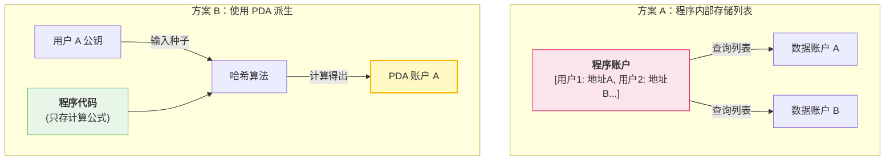
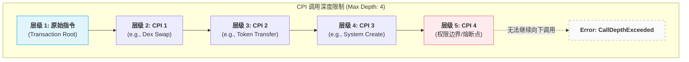

# 问题与答案

> 记录学习中的认知盲区与衍生的困惑。
>
> 针对理解尚浅的知识点进行复盘，并罗列相关疑问。
>
> 带着问题继续学习！

---

## 为什么程序不存储公钥地址，而是用PDA？

为什么 Solana 不直接存储公钥，而要大费周章地设计 PDA？答案隐藏在底层的架构逻辑中。我们可以从**并发执行效率**、**椭圆曲线数学特性**以及**账户状态管理**这三个层面，总结出其背后的四个技术必然性。

### 1. 解决并行执行的“性能瓶颈” (Concurrency & Lock Contention)

这是 Solana 性能大幅超越以太坊的核心。

- **传统做法（以太坊风格）：** 程序通常维护一个大的全局映射表（如 `mapping(address => UserData)`）。当多个用户同时操作时，所有的交易都必须排队等待修改同一个合约账户的数据，这造成了“状态锁死”。
- **Solana PDA 做法：** PDA 鼓励**状态去中心化**。程序不把数据存在自己名下，而是为每个用户派生一个独立的 PDA 账户。
- **底层收益：** 因为每个用户的 PDA 是独立的物理地址，Solana 的调度引擎（Sealevel）可以一眼看出交易 A 操作的是 `PDA_1`，交易 B 操作的是 `PDA_2`。**它们完全不冲突，可以在不同的 CPU 核心上同时并行处理。** 如果存公钥列表，你永远无法实现这种极致的并行。

------

### 2. 密码学上的“曲线外”安全性 (Off-Curve Addresses)

这是一个非常精妙的数学设计。

- **Ed25519 曲线：** 正常的钱包公钥是椭圆曲线上的一个点，必然对应一个私钥。
- **PDA 的原理：** 在计算 PDA 时，我们会加入一个 `bump`（通常是一个从 255 开始递减的数字）。计算的目标是找到一个哈希值，使其**强制落在椭圆曲线之外**。
- **技术结果：** 既然这个地址不在曲线上，那么在数学逻辑上，它就**绝对不可能存在对应的私钥**。
- **安全意义：** 这样就从底层物理规律上保证了：除了程序逻辑，没有任何力量（甚至是超级计算机）能通过“暴力破解私钥”的方式来接管 PDA 账户。

------

### 3. 实现“无状态”合约 (Stateless Contract Design)

Solana 的程序（智能合约）本身是只读的、无状态的。

- **设计哲学：** 所有的业务数据都必须存在外部账户（Account）中。
- **PDA 的角色：** PDA 充当了连接“无状态代码”和“持久化数据”的**确定性桥梁**。
- **优势：** 这种设计允许程序逻辑（代码）和用户数据（PDA）物理分离。如果程序需要升级，数据依然安全地锁在原来的 PDA 里，新程序只需使用相同的种子即可重新找回这些数据。

------

### 4. 节省跨程序调用 (CPI) 的开销

当程序 A 需要调用程序 B 操作某个资产时：

- 如果使用普通账户，程序 A 必须证明自己有权操作该账户，这通常涉及复杂的权限签名传递。
- 如果使用 PDA，程序 B 只需要验证：“这个地址是不是由程序 A 派生出来的？”
- **签名授权：** 只要程序 A 通过指令发起调用，系统会自动为该 PDA 提供一个虚拟的“授权标识”。这种**隐式授权**极大地降低了跨程序交互的字节开销和运算开销。

------

### 深度对比总结表

| **维度**     | **存储公钥列表 (Registry 模式)**         | **派生 PDA (Independent 模式)**        |
| ------------ | ---------------------------------------- | -------------------------------------- |
| **执行效率** | **串行** (所有用户竞争同一个写锁)        | **并行** (不同用户在不同 CPU 核心处理) |
| **存储上限** | 受单账户 10MB 限制                       | **无限** (每个用户一个独立账户)        |
| **地址发现** | 必须从全局列表搜索 ($O(n)$ 或哈希表查询) | 直接计算得出 O(1) 常数时间)            |
| **租金支付** | 通常由开发者垫付                         | 由用户在初始化 PDA 时支付 (更公平)     |

------

### 逻辑架构对比：存储 vs 派生

## 为什么 CPI 的调用深度限制为 4 ？

限制 CPI（跨程序调用）调用深度为 4，并非一个随意的数字，而是 Solana 架构在**资源隔离**、**安全防御**与**运行效率**之间权衡后的结果。

我们可以从以下三个核心维度来深度拆解这个限制：

------

### 1. 物理资源：虚拟机嵌套与内存开销 (VM Nesting)

Solana 的程序运行在 eBPF 虚拟机上。每次进行 CPI 调用时，系统实际上是在当前虚拟机的上方“嵌套”或“压入”一个新的虚拟机实例。

- **内存翻倍**：每个程序都有自己的 **堆栈 (Stack)**（约 4KB）和 **堆 (Heap)**（约 32KB）。当调用深度增加时，验证节点需要为每一层预留并清零对应的内存空间。
- **资源占用**：如果允许无限深度，单笔交易可能会消耗大量的验证节点内存，导致严重的资源浪费，甚至成为针对节点的拒绝服务（DoS）攻击手段。限制为 4 层是为了保证验证节点在处理高并发交易时，内存开销是**确定且可控**的。

### 2. 安全防御：防止重入攻击 (Reentrancy Mitigation)

重入攻击（如以太坊 The DAO 攻击）是智能合约最致命的威胁之一。Solana 通过底层的执行模型从物理上限制了这种风险：

- **状态隔离**：Solana 强制要求在交易开始前锁定所有相关账户。
- **深度防火墙**：将 CPI 限制在 4 层，形成了一个自然的“安全边界”。它防止了由于极其复杂的递归调用或多程序循环调用导致的逻辑失控。
- **可预测性**：较浅的调用链让运行时（Runtime）能更简单地校验账户状态的变更规则（例如：只有 Owner 才能修改数据），确保在调用链返回时，状态是一致且合法的。

### 3. 执行效率：计算预算与确定性 (Compute Budget)

Solana 是为了极高性能设计的，所有交易都必须在极短的时间内完成。

- **上下文切换成本**：程序之间的切换（即进入下一层 CPI）涉及到上下文的保存与恢复，这需要消耗额外的 **计算单元 (CU)**。
- **调度优化**：Solana 的调度引擎 (Sealevel) 需要在执行前精准预测交易的资源消耗。如果调用深度太深，执行路径的不确定性会大幅增加，导致并行调度算法难以最优地分配 CPU 核心。

------

### 逻辑结构示意图

我们可以将调用栈想象成一个物理容器，层级越高，系统的负担越重：

------

### ⚠️ 2026 年的最新进展

随着 Solana 运行时优化技术的提升，社区已经意识到 4 层限制对于日益复杂的 DeFi 组合（如聚合器套利）有些捉襟见肘。

根据 **SIMD-0268 (Raise CPI Nesting Limit)** 提案：

- **核心变化**：Solana 计划（或已部分实现）将最大嵌套深度从 **4 层提升至 8 层**。
- **技术前提**：这是建立在更高效的虚拟机上下文切换和动态内存分配基础之上的。

**你现在的开发场景中，是否遇到了 `CallDepthExceeded` 错误？如果是，通常可以通过“展平”逻辑（将嵌套调用拆分为平行的多个指令）来绕过这个限制。**

## 现实资产是如何转换成代币？

## 其他人是如何验证代币的真实性？或者说如何验证代币背后现实资产的真实性？
