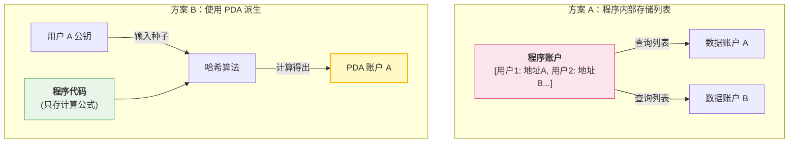
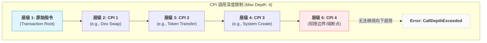
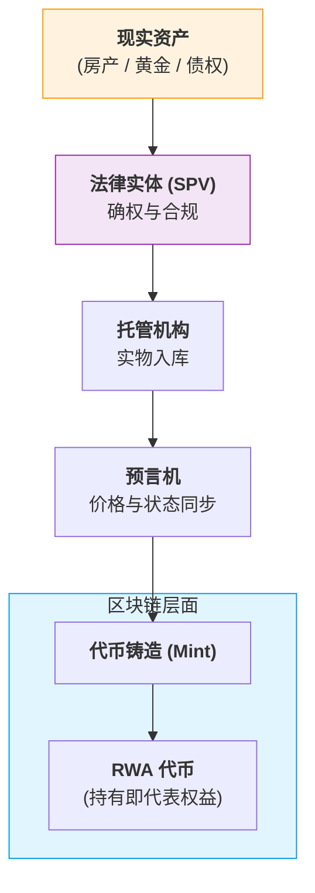
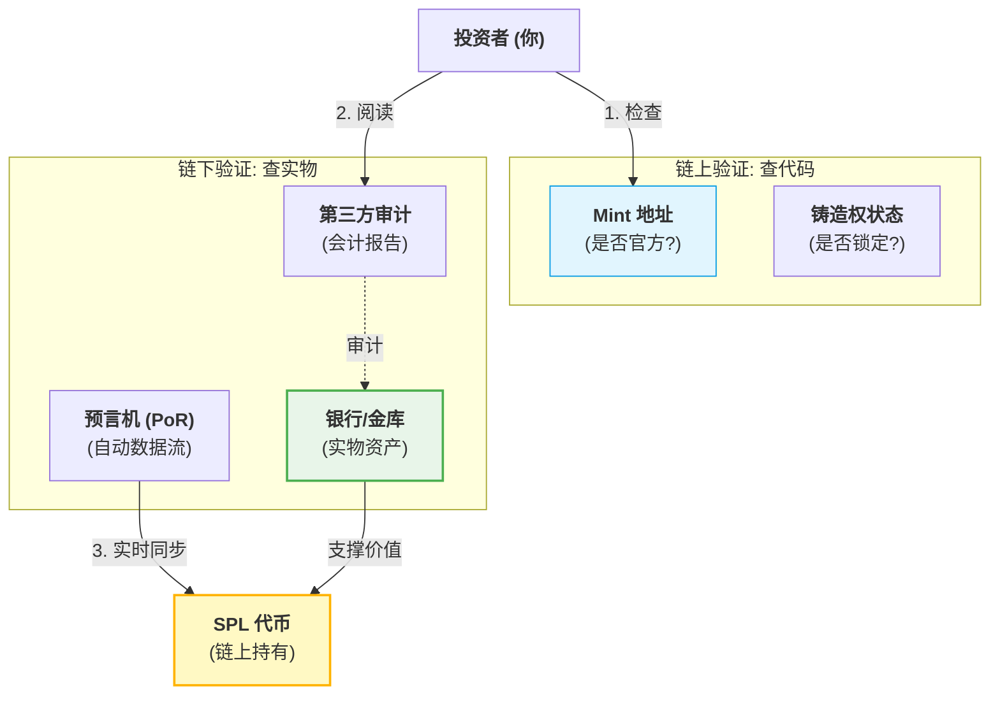

# 问题与答案

> 记录学习中的认知盲区与衍生的困惑。
>
> 针对理解尚浅的知识点进行复盘，并罗列相关疑问。
>
> 带着问题继续学习！

---

## 为什么程序不存储公钥地址，而是用PDA？

为什么 Solana 不直接存储公钥，而要大费周章地设计 PDA？答案隐藏在底层的架构逻辑中。我们可以从**并发执行效率**、**椭圆曲线数学特性**以及**账户状态管理**这三个层面，总结出其背后的四个技术必然性。

### 1. 解决并行执行的“性能瓶颈” (Concurrency & Lock Contention)

这是 Solana 性能大幅超越以太坊的核心。

- **传统做法（以太坊风格）：** 程序通常维护一个大的全局映射表（如 `mapping(address => UserData)`）。当多个用户同时操作时，所有的交易都必须排队等待修改同一个合约账户的数据，这造成了“状态锁死”。
- **Solana PDA 做法：** PDA 鼓励**状态去中心化**。程序不把数据存在自己名下，而是为每个用户派生一个独立的 PDA 账户。
- **底层收益：** 因为每个用户的 PDA 是独立的物理地址，Solana 的调度引擎（Sealevel）可以一眼看出交易 A 操作的是 `PDA_1`，交易 B 操作的是 `PDA_2`。**它们完全不冲突，可以在不同的 CPU 核心上同时并行处理。** 如果存公钥列表，你永远无法实现这种极致的并行。

### 2. 密码学上的“曲线外”安全性 (Off-Curve Addresses)

这是一个非常精妙的数学设计。

- **Ed25519 曲线：** 正常的钱包公钥是椭圆曲线上的一个点，必然对应一个私钥。
- **PDA 的原理：** 在计算 PDA 时，我们会加入一个 `bump`（通常是一个从 255 开始递减的数字）。计算的目标是找到一个哈希值，使其**强制落在椭圆曲线之外**。
- **技术结果：** 既然这个地址不在曲线上，那么在数学逻辑上，它就**绝对不可能存在对应的私钥**。
- **安全意义：** 这样就从底层物理规律上保证了：除了程序逻辑，没有任何力量（甚至是超级计算机）能通过“暴力破解私钥”的方式来接管 PDA 账户。

### 3. 实现“无状态”合约 (Stateless Contract Design)

Solana 的程序（智能合约）本身是只读的、无状态的。

- **设计哲学：** 所有的业务数据都必须存在外部账户（Account）中。
- **PDA 的角色：** PDA 充当了连接“无状态代码”和“持久化数据”的**确定性桥梁**。
- **优势：** 这种设计允许程序逻辑（代码）和用户数据（PDA）物理分离。如果程序需要升级，数据依然安全地锁在原来的 PDA 里，新程序只需使用相同的种子即可重新找回这些数据。

### 4. 节省跨程序调用 (CPI) 的开销

当程序 A 需要调用程序 B 操作某个资产时：

- 如果使用普通账户，程序 A 必须证明自己有权操作该账户，这通常涉及复杂的权限签名传递。
- 如果使用 PDA，程序 B 只需要验证：“这个地址是不是由程序 A 派生出来的？”
- **签名授权：** 只要程序 A 通过指令发起调用，系统会自动为该 PDA 提供一个虚拟的“授权标识”。这种**隐式授权**极大地降低了跨程序交互的字节开销和运算开销。

### 深度对比总结表

| **维度**     | **存储公钥列表 (Registry 模式)**         | **派生 PDA (Independent 模式)**        |
| ------------ | ---------------------------------------- | -------------------------------------- |
| **执行效率** | **串行** (所有用户竞争同一个写锁)        | **并行** (不同用户在不同 CPU 核心处理) |
| **存储上限** | 受单账户 10MB 限制                       | **无限** (每个用户一个独立账户)        |
| **地址发现** | 必须从全局列表搜索 ($O(n)$ 或哈希表查询) | 直接计算得出 O(1) 常数时间)            |
| **租金支付** | 通常由开发者垫付                         | 由用户在初始化 PDA 时支付 (更公平)     |

### 逻辑架构对比：存储 vs 派生

## 为什么 CPI 的调用深度限制为 4 ？

限制 CPI（跨程序调用）调用深度为 4，并非一个随意的数字，而是 Solana 架构在**资源隔离**、**安全防御**与**运行效率**之间权衡后的结果。

我们可以从以下三个核心维度来深度拆解这个限制：

### 1. 物理资源：虚拟机嵌套与内存开销 (VM Nesting)

Solana 的程序运行在 eBPF 虚拟机上。每次进行 CPI 调用时，系统实际上是在当前虚拟机的上方“嵌套”或“压入”一个新的虚拟机实例。

- **内存翻倍**：每个程序都有自己的 **堆栈 (Stack)**（约 4KB）和 **堆 (Heap)**（约 32KB）。当调用深度增加时，验证节点需要为每一层预留并清零对应的内存空间。
- **资源占用**：如果允许无限深度，单笔交易可能会消耗大量的验证节点内存，导致严重的资源浪费，甚至成为针对节点的拒绝服务（DoS）攻击手段。限制为 4 层是为了保证验证节点在处理高并发交易时，内存开销是**确定且可控**的。

### 2. 安全防御：防止重入攻击 (Reentrancy Mitigation)

重入攻击（如以太坊 The DAO 攻击）是智能合约最致命的威胁之一。Solana 通过底层的执行模型从物理上限制了这种风险：

- **状态隔离**：Solana 强制要求在交易开始前锁定所有相关账户。
- **深度防火墙**：将 CPI 限制在 4 层，形成了一个自然的“安全边界”。它防止了由于极其复杂的递归调用或多程序循环调用导致的逻辑失控。
- **可预测性**：较浅的调用链让运行时（Runtime）能更简单地校验账户状态的变更规则（例如：只有 Owner 才能修改数据），确保在调用链返回时，状态是一致且合法的。

### 3. 执行效率：计算预算与确定性 (Compute Budget)

Solana 是为了极高性能设计的，所有交易都必须在极短的时间内完成。

- **上下文切换成本**：程序之间的切换（即进入下一层 CPI）涉及到上下文的保存与恢复，这需要消耗额外的 **计算单元 (CU)**。
- **调度优化**：Solana 的调度引擎 (Sealevel) 需要在执行前精准预测交易的资源消耗。如果调用深度太深，执行路径的不确定性会大幅增加，导致并行调度算法难以最优地分配 CPU 核心。

### 逻辑结构示意图

我们可以将调用栈想象成一个物理容器，层级越高，系统的负担越重：

### ⚠️ 2026 年的最新进展

随着 Solana 运行时优化技术的提升，社区已经意识到 4 层限制对于日益复杂的 DeFi 组合（如聚合器套利）有些捉襟见肘。

根据 **SIMD-0268 (Raise CPI Nesting Limit)** 提案：

- **核心变化**：Solana 计划（或已部分实现）将最大嵌套深度从 **4 层提升至 8 层**。
- **技术前提**：这是建立在更高效的虚拟机上下文切换和动态内存分配基础之上的。

## 现实资产是如何转换成代币？

将现实资产（Real World Assets, 简称 **RWA**）转换为代币的过程，技术上称为**“代币化”（Tokenization）**。

这不仅仅是写一段程序代码，它实际上是一个**法律、实物保管与区块链技术**三方协作的复杂过程。你可以将其想象成给现实世界的资产办一张“数字身份证”，并让这张身份证在链上具有法律效力。

以下是现实资产转换为代币的四个核心阶段：

### 1. 资产确权与合规（线下准备）

在任何代码运行之前，必须先在法律层面完成“所有权”的定义。

- **资产选择**：确定要代币化的资产（如房产、国债、黄金、艺术品）。
- **设立 SPV（特殊目的实体）**：通常会成立一家独立公司来持有该资产。这样，持有代币的人实际上是持有这家公司的股份或债权，从而间接拥有资产。
- **法律合规**：确保符合当地法律（如美国的 SEC 监管），并完成 KYC（身份验证）和 AML（反洗钱）流程。

### 2. 托管与审计（信任建立）

区块链无法感知现实世界。为了保证“链上 1 个代币 = 线下 1 克黄金”，需要中介机构提供担保。

- **托管人 (Custodian)**：资产必须存放在受监管的银行、保险库或第三方托管机构手中。
- **预言机 (Oracle)**：像 **Pyth** 或 **Chainlink** 这样的程序，会将线下资产的实时价格或状态（比如黄金还在不在仓库里）传送到链上。
- **储备证明 (Proof of Reserves)**：由审计机构定期发布报告，证明链下确实有足额资产撑腰。

### 3. 链上铸造（技术实施）

一旦法律和托管就绪，开发者就在 Solana 等链上通过程序发行代币。

- **创建 Mint 账户**：定义代币的总量和精度。
- **配置代币扩展 (Token Extensions)**：这是 Solana 2022 标准的强大之处。开发者可以给代币增加特殊逻辑，例如：
  - **转账钩子 (Transfer Hook)**：只有通过了身份验证的人才能接收这个代币。
  - **机密转账**：保护大额资产交易隐私。
- **元数据 (Metadata)**：将资产的描述、法律合同的哈希值或房产证的照片链接写入代币数据中。

### 4. 流通与赎回（生命周期管理）

- **二级市场交易**：代币可以在 DEX（去中心化交易所）上像 USDC 一样买卖。
- **收益分发**：如果资产是国债或收租的房产，程序会自动通过代码将收益分发给所有代币持有者。
- **赎回 (Redemption)**：用户可以销毁代币，换回实物资产或等值法币。

### RWA 转换流程逻辑图

------

### 为什么 Solana 是 RWA 的理想选择？

相比于其他公链，Solana 在资产代币化上有两个“杀手锏”：

1. **Token Extensions (代币扩展)**：它允许在代币层级直接集成**合规限制**（例如禁止某些地址持有、强制转账审批），这对于受监管的金融资产至关重要。
2. **极低的手续费**：如果你要将一栋楼拆成 100 万份卖给全球用户，极低的交易成本（不到 0.01 美元）让这种“碎片化所有权”变得有利可图。

### 目前常见的 RWA 案例

- **国债代币化**：如 **Ondo Finance**，让全球用户能通过代币赚取美国国债的利息。
- **房地产**：如 **Homebase**，你可以像买股票一样买入某栋房子的几分之几。
- **稳定币**：**USDC** 本质上就是最成功的 RWA（现实资产是美元和美债）。

## 其他人是如何验证代币的真实性？或者说如何验证代币背后现实资产的真实性？

验证代币的“真实性”其实分为两个完全不同的层面：一个是**技术层面**（这个代币是不是官方发行的那张“票”？），另一个是**资产层面**（票据背后对应的金条、美元或房产是否真的存在？）。

在 Solana 上，验证这两种真实性有一套标准化的“侦探工具”。

### 一、 技术验证：这是“官方”代币吗？

这一步是为了防止你买到同名的假代币。因为任何人都可以创建一个叫“USDC”的代币。

1. **验证 Mint 地址（合约地址）**
   - **方法**：永远不要通过名字搜索代币。去项目官网、CoinGecko 或 CoinMarketCap 复制其 **Mint Address**。
   - **工具**：在 [Solscan](https://solscan.io/) 或 [Solana Explorer](https://explorer.solana.com/) 中粘贴该地址。如果是真正的主流代币，浏览器通常会显示一个“蓝色勾选框”或“Verified”标志。
2. **检查 Mint Authority（铸造权限）**
   - **逻辑**：如果代币的“铸造权”在一个私人钱包手里，他可以随时无限印钱。
   - **安全信号**：理想情况下，Mint Authority 应该是**已注销（Disabled/Burned）**或者是受监管机构（如 Circle 的多签钱包）控制。
3. **代码可验证性 (Verified Builds)**
   - **方法**：对于有特殊功能的代币，开发者可以使用 `solana-verify` 工具。这能证明链上运行的二进制代码与他们在 GitHub 上公开的代码完全一致。

### 二、 资产验证：背后的实物真的存在吗？

这是 RWA（现实资产）代币化的难点。验证者不能只看链上，必须看“链下”。

#### 1. 储备证明 (Proof of Reserves, PoR) —— **实时验证**

这是最先进的方法。通过 **Chainlink** 等预言机，将银行或金库的实时余额数据抓取到链上。

- **例子**：如果一个黄金代币号称有 100 公斤黄金，预言机会定期检查金库的传感器数据或电子审计记录。如果金库少了 10 公斤，链上程序会自动报警。

#### 2. 独立审计报告 (Attestations) —— **周期验证**

- **方法**：发行方聘请第三方会计师事务所（如德勤、普华永道）定期对账户进行突击检查。
- **查看点**：在项目官网下载 **Monthly Attestation Report**。例如，USDC 的发行方 Circle 每月都会发布由 Grant Thornton 审计的储备报告。

#### 3. 托管机构 (Custodians) —— **信用验证**

- **逻辑**：资产不应该存在发行方自己的保险箱里，而应该存在受监管的第三方银行（如 BNY Mellon）或合规托管机构（如 Coinbase Custody）。
- **验证点**：查看项目的法律白皮书，确认谁是 **Custodian**。如果托管人是知名大银行，可信度大幅提升。

### 三、 法律验证：你有权“赎回”吗？

即使资产存在，如果法律上不承认你的代币，那它也只是一段数字。

- **SPV (特殊目的实体)**：大多数 RWA 项目会成立一个独立的 SPV 公司。
- **法律文件映射**：代币的元数据中通常会包含一个指向**法律契约**的哈希值。这意味着在法律层面，持有该代币等同于持有该 SPV 的债权或股份。
- **Token Extensions (代币扩展)**：Solana 的 **Token-2022** 标准允许在代币里直接写逻辑。比如“只有经过 KYC 的地址才能持有”，这保证了资产在流转过程中始终符合监管要求。

### RWA 验证逻辑流向图

### 验证总结清单 (Checklist)

| **验证项**     | **验证方式**                           | **风险信号**               |
| -------------- | -------------------------------------- | -------------------------- |
| **代币身份**   | Solscan 查看 Mint 地址是否有官方 Logo  | 没有任何认证，只有名字     |
| **铸造权限**   | 检查 Mint Authority 是否为 Null 或多签 | 由单一未知地址控制         |
| **资产透明度** | 官网是否有最新的审计 PDF 报告          | 超过 3 个月没有更新报告    |
| **实时性**     | 是否接入了 Chainlink Proof of Reserve  | 仅靠官方推特承诺           |
| **法律保障**   | 代币元数据是否链接到法律合同           | 只有一段描述，没有法律条文 |
