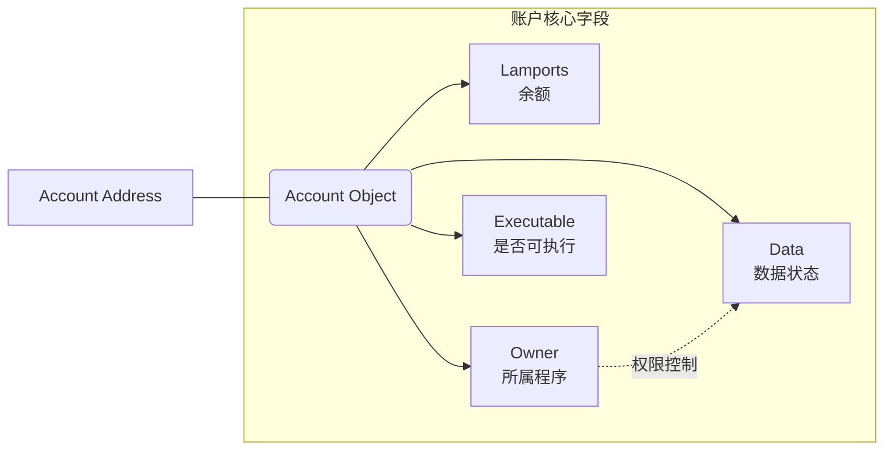
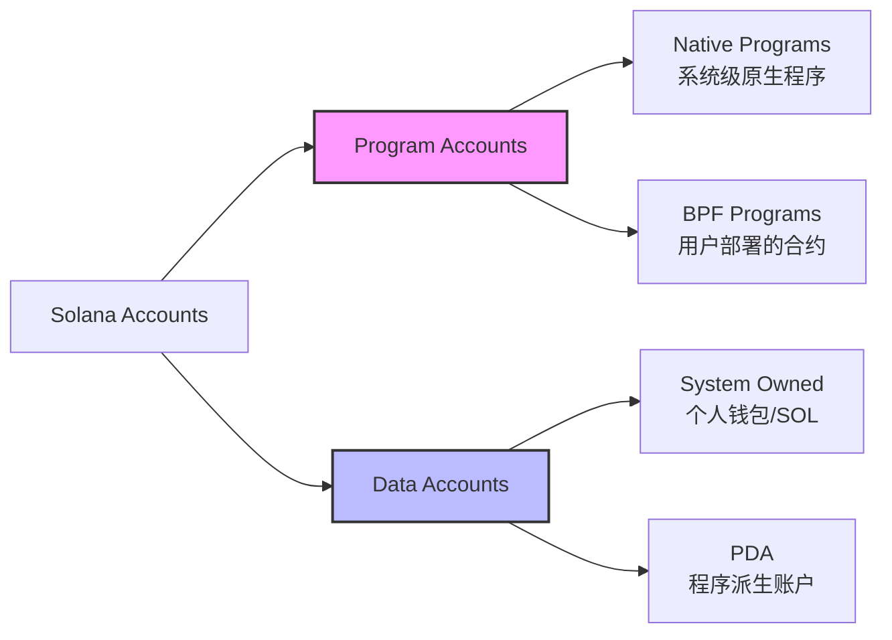
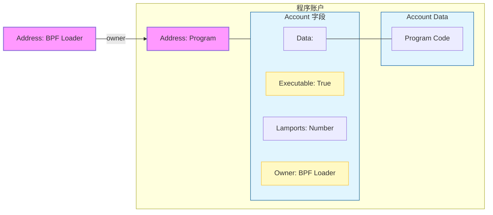
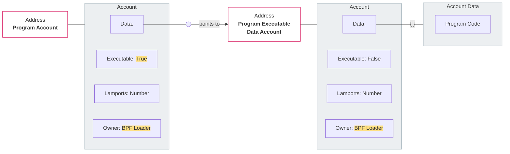
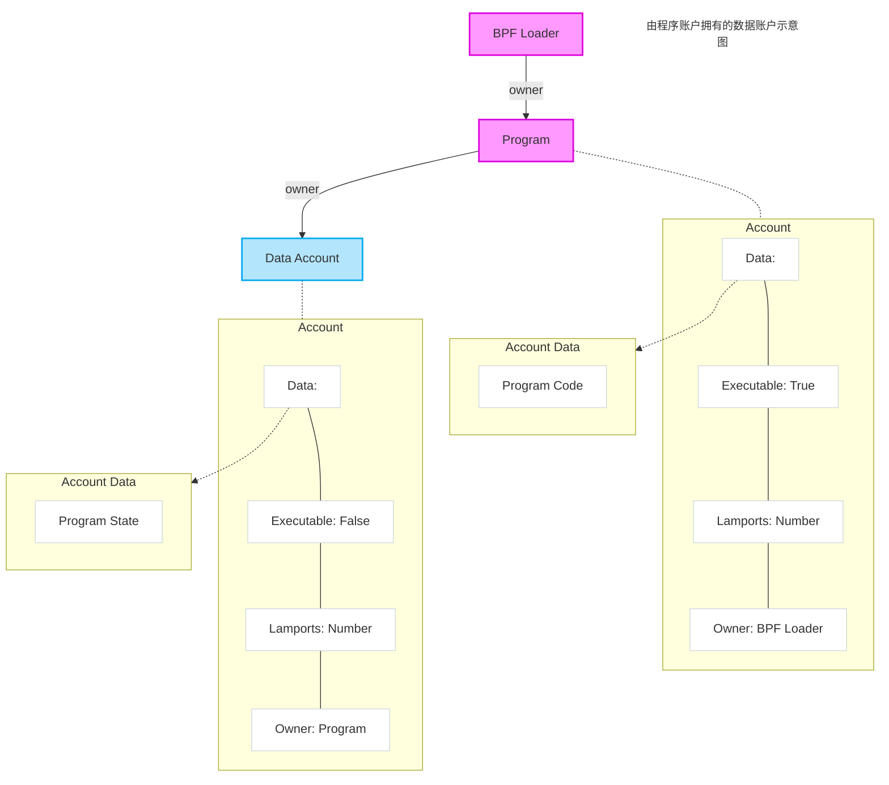
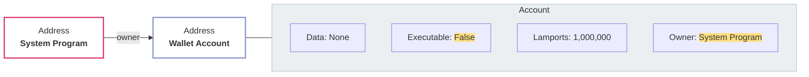
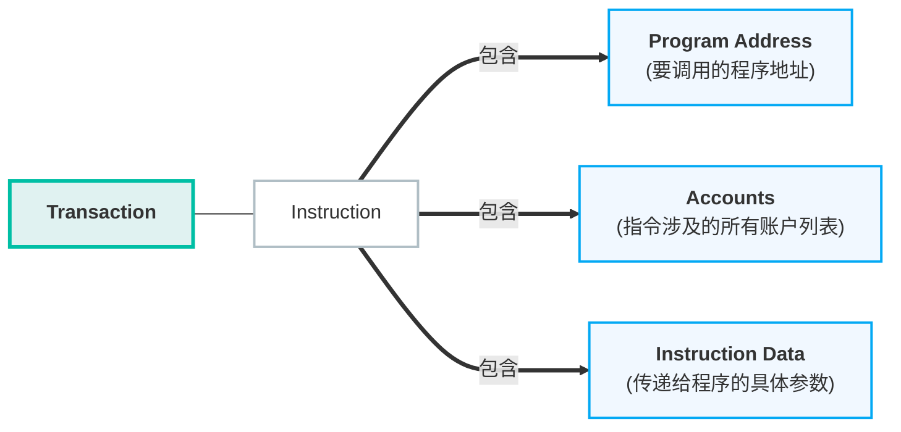
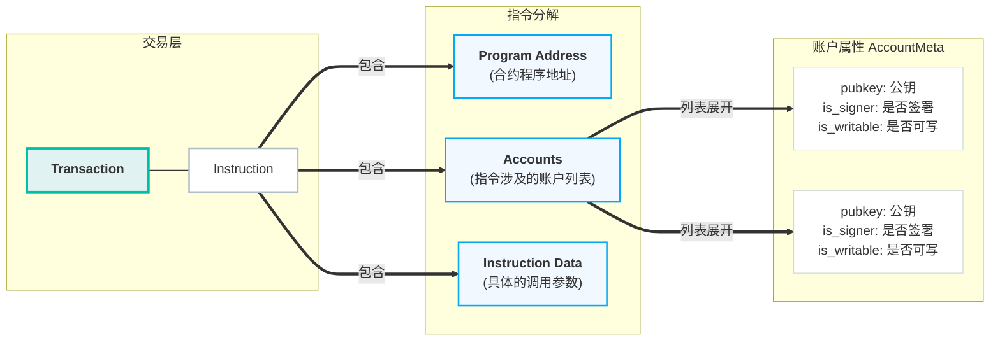
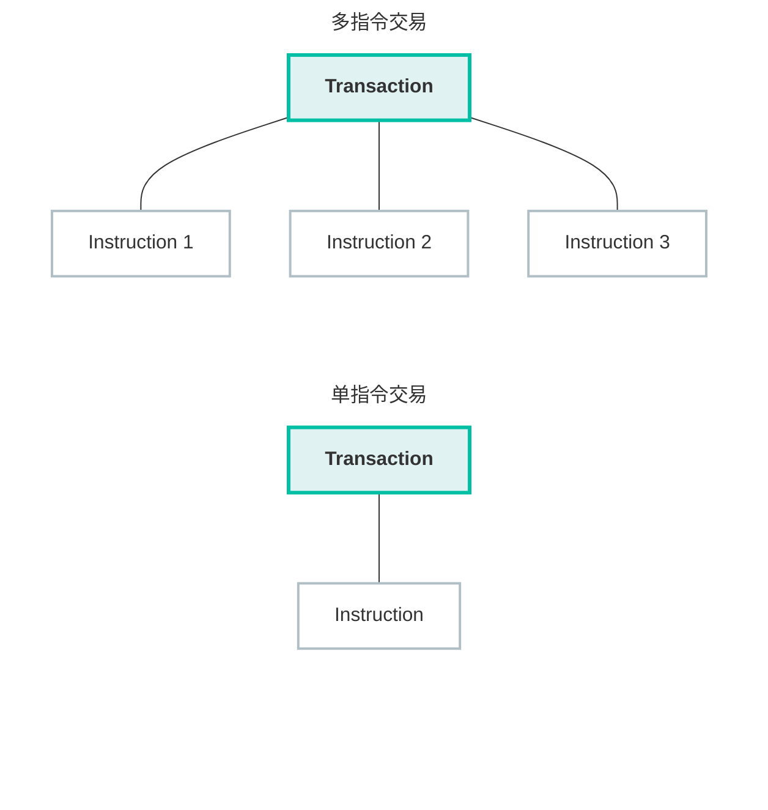

# Solana

**Solana（SOL）是一个专为高速、低成本交易而设计的高性能区块链平台。**

它通常被比作“区块链界的赛车”，因为它的处理速度远超比特币和以太坊，目标是为去中心化应用（DApps）、金融服务（DeFi）和 NFT 市场提供一个大规模扩展的基础设施。

## Solana 的核心特点

Solana 的崛起主要归功于它解决了一个被称为“区块链不可能三角”（即无法同时实现安全性、去中心化和高性能）的尝试。

- **极高的速度：** 理论上每秒可处理超过 **65,000 笔交易 (TPS)**，而以太坊（升级前）通常只有 15-30 TPS。

- **极低的手续费：** 每一笔交易的平均费用仅为 **$0.00025** 左右。你可以用 1 美元支付成千上万次转账。

- **原生代币 SOL：** 用于支付网络上的交易手续费，也可以通过“质押”来赚取奖励并参与网络治理。

### 为什么它能这么快？（核心技术）

[**There are 8 key innovations that make the Solana network possible**](https://solana.com/zh/news/sealevel---parallel-processing-thousands-of-smart-contracts)

>- [**Proof of History (POH)**](https://solana.ghost.io/solana-labs/proof-of-history-a-clock-for-blockchain-cf47a61a9274) — a clock before consensus;
>
>- [**Tower BFT**](https://medium.com/solana-labs/tower-bft-solanas-high-performance-implementation-of-pbft-464725911e79) — a PoH-optimized version of PBFT;
>- [**Turbine**](https://solana.ghost.io/solana-labs/turbine-solanas-block-propagation-protocol-solves-the-scalability-trilemma-2ddba46a51db) — a block propagation protocol;
>- [**Gulf Stream**](https://solana.ghost.io/solana-labs/gulf-stream-solanas-mempool-less-transaction-forwarding-protocol-d342e72186ad) — Mempool-less transaction forwarding protocol;
>- [**Sealevel**](https://medium.com/solana-labs/sealevel-parallel-processing-thousands-of-smart-contracts-d814b378192) — Parallel smart contracts run-time;
>- [**Pipelining**](https://solana.com/pipelining-in-solana-the-transaction-processing-unit/) — a Transaction Processing Unit for validation optimization
>- [**Cloudbreak**](https://medium.com/solana-labs/cloudbreak-solanas-horizontally-scaled-state-architecture-9a86679dcbb1) — Horizontally-Scaled Accounts Database; and
>- [**Archivers**](https://solana.com/archivers/) — Distributed ledger store

#### 1. 历史证明 (Proof of History, PoH) —— 共识前的“时钟”

这是 Solana 的基石。在传统区块链中，节点需要通过大量通信来确认交易发生的先后顺序（类似开会确认时间）。PoH 通过在账本中嵌入一个不可伪造的时间戳，让节点无需互相通信就能证明交易发生的先后顺序。

- **作用：** 极大地减少了节点间的通信开销，为网络提供了统一的时间参考。

#### 2. 塔式 BFT (Tower BFT) —— PoH 优化的算法

它是 Solana 版的实用拜占庭容错（PBFT）算法。由于有了 PoH 提供的统一时钟，节点在达成共识时不需要从头开始协商，而是利用 PoH 记录的时间轴来快速投票。

- **作用：** 大幅降低了达成共识的延迟（Latency）。

#### 3. 涡轮机 (Turbine) —— 区块传播协议

当一个大区块需要传输给数千个节点时，带宽压力极大。Turbine 将数据拆分成许多小数据包，采用类似于“激流（BitTorrent）”的树状结构进行传输。

- **作用：** 解决了大容量数据在网络中快速广播的瓶颈。

#### 4. 湾流 (Gulf Stream) —— 无内存池的转发协议

在以太坊中，交易会堆积在“内存池（Mempool）”中等待打包。而在 Solana 中，验证者可以提前知道未来的领导者（Leader），因此客户端可以直接将交易转发给即将上任的验证者。

- **作用：** 减少了确认时间，降低了验证者的内存压力，实现了极高的吞吐量。

#### 5. 海平面 (Sealevel) —— 并行智能合约运行时

传统公链通常是单线程执行（一次处理一个合约）。Sealevel 允许成千上万个不冲突的智能合约在多核 CPU 和 GPU 上**并行处理**。

- **作用：** 只要硬件性能足够（核心数多），处理速度就能线性提升。

#### 6. 流水线 (Pipelining) —— 验证优化处理单元

流水线是一种硬件优化技术。Solana 将交易验证的过程分为：获取数据、解密、验证签名、写入数据等步骤。不同的硬件模块可以同时处理不同交易的各个阶段（就像工厂流水线）。

- **作用：** 使得硬件效率利用到极致，进一步缩短了区块确认时间。

#### 7. 云断层 (Cloudbreak) —— 水平扩展的账户数据库

随着用户增多，读写账本数据的压力会剧增。Cloudbreak 是一种为大规模并行读写优化的数据结构，它不再依赖传统的单一数据库，而是利用内存映射文件（Memory-mapped files）和 SSD 协同工作。

- **作用：** 解决了在大规模并行环境下的数据读写瓶颈。

#### 8. 归档器 (Archivers) —— 分布式账本存储

Solana 每年产生的数据量非常巨大。为了防止普通节点因存储空间不足而退出，Solana 将数据分片并存储在名为 Archivers 的轻量级节点中。

- **作用：** 保证了账本数据的安全存储，同时降低了高性能验证者的存储负担。

------

#### 总结

Solana 的“快”是**全方位的硬件级优化**：

- **PoH 和 Tower BFT** 解决了“沟通慢”的问题；
- **Turbine 和 Gulf Stream** 解决了“传输慢”的问题；
- **Sealevel 和 Pipelining** 解决了“计算慢”的问题；
- **Cloudbreak 和 Archivers** 解决了“读写和存储慢”的问题。

这些创新共同作用，使 Solana 成为了目前公认的最接近硬件性能极限的区块链网络。

---


## 账户 (account)

> Everything is an Account

在 Solana 中，**“万物皆账户”**——无论是用户的钱包、智能合约（程序），还是合约存储的数据，都以账户的形式存在。就像 Linux 世界里把所有的资源都抽象成"文件"一样。

Solana 网络上的所有数据都存储在账户中。您可以将 Solana 网络视为一个包含单一账户表的公共数据库。账户与其地址之间的关系类似于键值对，其中键是地址，值是账户。

每个账户都有相同的基本**结构**，并且可以通过其**地址**找到。

这张图展示了每一个 Solana 账户内部到底存了什么：



### 账户地址

账户地址是一个 32 字节的唯一 ID，用于在 Solana 区块链上定位账户。账户地址通常以 base58 编码字符串的形式显示。大多数账户使用 **Ed25519 公钥**作为其地址，但这并不是强制性的，因为 Solana 还支持**程序派生地址**。


### 账户数据结构

```rust
pub struct Account {
    /// lamports in the account
    pub lamports: u64,
    /// data held in this account
    #[cfg_attr(feature = "serde", serde(with = "serde_bytes"))]
    pub data: Vec<u8>,
    /// the program that owns this account. If executable, the program that loads this account.
    pub owner: Pubkey,
    /// this account's data contains a loaded program (and is now read-only)
    pub executable: bool,
    /// the epoch at which this account will next owe rent
    pub rent_epoch: Epoch,
}
```

每个 `Account` 的最大大小为 10MiB，并包含以下信息：

- `lamports`: 账户中的 `lamports` 数量
- `data`: 账户的数据
- `owner`: 拥有该账户的程序的 ID
- `executable`: 指示账户是否包含可执行二进制文件
- `rent_epoch`: 已弃用的租金 epoch 字段

#### Lamports

账户的余额以 `lamports`为单位。

每个账户必须有一个最低 **lamports** 余额，称为**租金**，这允许其数据存储在链上。租金与账户的大小成正比。

> [!NOTE]
>
> 虽然这个余额被称为 rent，但它更像是押金，因为当账户关闭时，可以全额取回余额。（"rent" 这个名称来源于现已弃用的 rent epoch 字段。）

#### data

此字段通常被称为“账户数据”。此字段中的`data`被认为是任意的，因为它可以包含任何字节序列。每个程序定义存储在此字段中的数据结构。

- 程序账户：此字段包含可执行**程序代码**或**程序数据账户**的地址，该账户存储可执行程序代码。
- 数据账户：此字段通常存储状态数据，供读取使用。

从 Solana 账户读取数据涉及两个步骤：

1. 使用其**地址**取账户
2. 将账户的`data`字段从原始字节反序列化为适当的数据结构，由拥有该账户的程序定义。

#### owner

此字段包含账户所有者的程序 ID。

每个 Solana 账户都有一个**程序**其所有者。账户的所有者是唯一可以更改账户的`data`或根据程序指令扣除 `lamports` 的程序。

（对于程序账户，其所有者是其**加载程序**。）

#### executable

此字段指示账户是**程序账户 (program accounts)**还是**数据账户 (data accounts)**。

- 如果`true`：该账户是程序账户
- 如果`false`：该账户是数据账户

#### 租赁 epoch

**`rent_epoch`字段已被弃用。**

过去，此字段用于跟踪账户何时需要支付租金。然而，此租金收取机制现已被弃用。


### 账户类型



账户分为两大类：

- 程序账户：包含可执行代码的账户
- 数据账户：不包含可执行代码的账户

程序代码与其状态的分离是 Solana 账户模型的一个关键特性。（类似于操作系统，通常将程序和其数据分为不同的文件。）

#### 程序账户

每个程序都由一个**加载器程序**拥有，用于部署和管理账户。当部署一个新的程序时，会创建一个账户来存储其可执行代码。这被称为程序账户。（为了简化，可以将程序账户视为程序本身。）

在下图中，可以看到一个加载器程序被用来部署一个程序账户。程序账户的 `data` 包含可执行的程序代码。



##### 程序数据账户

使用 loader-v3 部署的程序，其 `data` 字段中不包含程序代码。相反，其 `data` 指向一个单独的 **程序数据账户**，该账户包含程序代码。（见下图。）



> [!NOTE]
>
> 在程序部署或升级期间，缓冲账户用于临时存储上传内容。

#### 数据账户

数据账户不包含可执行代码，而是用于存储信息。

##### 程序状态账户

程序使用数据账户来维护其状态。为此，程序必须首先创建一个新的数据账户。创建程序状态账户的过程通常是抽象的，但了解其底层过程是有帮助的。

为了管理其状态，一个新程序必须：

1. 调用 **System Program** 来创建一个账户。（然后 System Program 将所有权转移给新程序。）
2. 根据其 **instructions** 初始化账户数据。



##### 系统账户

并非所有账户在由`System Program` 创建后都会被分配一个新所有者。由 `System Program` 拥有的账户称为系统账户。所有钱包账户都是系统账户，这使它们能够支付**交易费用**。



##### Sysvar 账户

Sysvar 账户存在于预定义的地址，并提供对集群状态数据的访问。它们会动态更新网络集群的相关数据。查看完整列表：[Sysvar Accounts](https://docs.anza.xyz/runtime/sysvars)。


## 指令 instructions

指令是与 Solana 区块链交互的基本构建块。指令本质上是一个**公共函数**，任何使用 Solana 网络的人都可以调用。每个指令用于执行特定的操作。指令的执行逻辑存储在程序中，每个程序定义其自己的指令集。要与 Solana 网络交互，需要将一个或多个指令添加到**交易**中并发送到网络进行处理。

### SOL 转账示例

下图展示了交易和指令如何协同工作，使用户能够与网络交互。在此示例中，SOL 从一个账户转移到另一个账户。

发送方账户的**元数据**表明它必须为交易签名。（这允许系统程序扣除lamports。）发送方和接收方账户都必须是可写的，以便其 lamport 余额发生变化。为了执行此指令，发送方的钱包发送包含其 签名 和包含 SOL 转账指令的消息的交易。


交易发送后，系统程序处理转账指令并更新两个账户的 lamport 余额。


### 指令



一个 `Instruction` 包含以下信息：

- `program_id`：被调用程序的**ID**。
- `accounts`：一个 **账户元数据** 的数组。
- `data`：一个包含指令所需额外[数据]的字节数组。

```rust
pub struct Instruction {
    /// Pubkey of the program that executes this instruction.
    pub program_id: Pubkey,
    /// Metadata describing accounts that should be passed to the program.
    pub accounts: Vec<AccountMeta>,
    /// Opaque data passed to the program for its own interpretation.
    pub data: Vec<u8>,
}
```

#### 程序 ID

指令的[`program_id`](https://solana.com/docs/references/terminology#program-id)是包含指令业务逻辑的程序的公钥地址。

#### 账户元数据

指令的 `accounts` 数组是一个 `AccountMeta` 结构体的数组。每个指令交互的账户都必须提供元数据。（这允许交易并行执行指令，只要它们不修改同一个账户。）

下图展示了一个包含单个指令的交易。指令的 `accounts` 数组包含两个账户的元数据



账户元数据包括以下信息：

- pubkey：账户的公钥地址
- is_signer：如果账户必须签署交易，则设置为 `true`
- is_writable：如果指令修改账户的数据，则设置为 `true`

> [!NOTE]
>
> 要了解指令需要哪些账户，包括哪些必须是可写、只读或签署交易的账户，您必须参考程序定义的指令实现。

```rust
pub struct AccountMeta {
    /// An account's public key.
    pub pubkey: Pubkey,
    /// True if an `Instruction` requires a `Transaction` signature matching `pubkey`.
    pub is_signer: bool,
    /// True if the account data or metadata may be mutated during program execution.
    pub is_writable: bool,
}
```

#### 数据 data

指令的 `data` 是一个字节数组，用于指定调用程序的哪条指令。它还包括指令所需的任何参数。


## 交易 (transactions)

要与 Solana 网络交互，您必须发送一笔交易。您可以将交易视为一个装有多种表单的信封。每个表单都是一条指令，告诉网络该做什么。发送交易就像邮寄信封，以便处理这些表单。

下面的示例展示了两个交易的简化版本。当第一个交易被处理时，它将执行一条指令。当第二个交易被处理时，它将按**顺序**执行三条指令：首先是指令 1，然后是指令 2，最后是指令 3。

> [!WARNING]
>
> 交易是**原子性**的：如果单条指令失败，整个交易将失败，并且不会发生任何更改。



一个 `Transaction` 包含以下信息：

- `signatures`：一个**签名**数组
- `message`：交易信息，包括要处理的指令列表

```rust
pub struct Transaction {
    #[wasm_bindgen(skip)]
    #[serde(with = "short_vec")]
    pub signatures: Vec<Signature>,

    #[wasm_bindgen(skip)]
    pub message: Message,
}
```


交易的总大小限制为 **1232** 字节。此限制包括 `signatures`数组和 `message`结构体。

> [!NOTE]
>
> 此限制旨在避免典型互联网基础设施上的数据包分片。虽然 IPv6 支持大于 9000 字节的 MTU，但大多数互联网路由器使用 1500 字节的默认 MTU（标准以太网）。为了确保交易能够在不分片的情况下适合单个数据包，Solana 使用 1280 字节（IPv6 所需的最小 MTU）减去 48 字节的网络头（40 字节的 IPv6 + 8 字节的分片/UDP 头），最终得出 1232 字节的交易大小限制。


### 签名 (signatures)

交易的 `signatures` 数组包含 `Signature` 结构体。每个 `Signature` 为 64 字节，通过使用账户的**私钥**对交易的 `Message` 进行签名创建。每个 **签名账户**的指令都必须提供一个签名。

第一个签名属于支付交易**基础费**的账户，并且是交易签名。交易签名可用于在网络上查找交易的详细信息。

### 消息

交易的 `message` 是一个 `Message` 结构体，包含以下信息：

- `header`：消息的头部
- `account_keys`：一个 **账户地址** 数组，交易指令所需的
- `recent_blockhash`：一个 **区块哈希**，作为交易的时间戳
- `instructions`：一个 **指令** 数组

> [!NOTE]
>
> 为了节省空间，交易不会单独存储每个账户的权限。相反，账户权限是通过 `header` 和 `account_keys` 确定的。

```rust
pub struct Message {
    /// The message header, identifying signed and read-only `account_keys`.
    pub header: MessageHeader,

    /// All the account keys used by this transaction.
    #[serde(with = "short_vec")]
    pub account_keys: Vec<Pubkey>,

    /// The id of a recent ledger entry.
    pub recent_blockhash: Hash,

    /// Programs that will be executed in sequence and committed in
    /// one atomic transaction if all succeed.
    #[serde(with = "short_vec")]
    pub instructions: Vec<CompiledInstruction>,
}
```

### 头部

消息的 `header` 是一个 `MessageHeader` 结构体，包含以下信息：

- `num_required_signatures`：交易所需的总签名数
- `num_readonly_signed_accounts`：需要签名的只读账户总数
- `num_readonly_unsigned_accounts`：不需要签名的只读账户总数

```rust
pub struct MessageHeader {
    /// The number of signatures required for this message to be considered
    /// valid. The signers of those signatures must match the first
    /// `num_required_signatures` of [`Message::account_keys`].
    pub num_required_signatures: u8,

    /// The last `num_readonly_signed_accounts` of the signed keys are read-only
    /// accounts.
    pub num_readonly_signed_accounts: u8,

    /// The last `num_readonly_unsigned_accounts` of the unsigned keys are
    /// read-only accounts.
    pub num_readonly_unsigned_accounts: u8,
}
```


### 账户地址

消息的 `account_keys` 是一个账户地址数组，以 **紧凑数组格式** 发送。数组的前缀表示其长度。数组中的每一项是一个公钥，指向其指令使用的账户。`accounts_keys` 数组必须完整，并严格按以下顺序排列：

1. 签名者 + 可写
2. 签名者 + 只读
3. 非签名者 + 可写
4. 非签名者 + 只读

> [!NOTE]
>
> 严格的排序允许 `account_keys` 数组与消息的 `header`中的信息结合，以确定每个账户的权限。


### 最近的区块哈希

消息的 `recent_blockhash` 是一个哈希值，作为交易的时间戳并防止重复交易。区块哈希在 [150 个区块](https://github.com/anza-xyz/agave/blob/v2.1.13/sdk/clock/src/lib.rs#L134)后过期。（相当于一分钟——假设每个区块为 400 毫秒。）区块过期后，交易也会过期，无法被处理。

###  指令

消息的 `instructions`是一个包含所有待处理指令的数组，采用紧凑数组格式。数组的前缀表示其长度。数组中的每一项是一个 `CompiledInstruction` 结构体，包含以下信息：

1. `program_id_index`：一个索引，指向 `account_keys` 数组中的地址。此值表示处理该指令的程序的地址。
2. `accounts`：一个索引数组，指向 `account_keys` 数组中的地址。每个索引指向该指令所需账户的地址。
3. `data`：一个字节数组，指定要在程序上调用的指令。它还包括指令所需的任何附加数据。（例如，函数参数）

```rust
pub struct CompiledInstruction {
    /// Index into the transaction keys array indicating the program account that executes this instruction.
    pub program_id_index: u8,
    /// Ordered indices into the transaction keys array indicating which accounts to pass to the program.
    #[serde(with = "short_vec")]
    pub accounts: Vec<u8>,
    /// The program input data.
    #[serde(with = "short_vec")]
    pub data: Vec<u8>,
}
```


## 交易费用

每笔 Solana 交易都需要支付交易费用，以 SOL 结算。交易费用分为两部分：基础费用和优先费用。基础费用用于补偿验证者处理交易的成本。优先费用是可选费用，用于增加当前领导者处理您交易的可能性。

### 基础费用

每笔交易的每个包含的签名费用为 5000 `lamports`。此费用由交易的第一个签名者支付。只有由 System Program 拥有的账户才能支付交易费用。基础费用的分配如下：

- **50% 销毁：** 一半费用被 **销毁**（从流通的 SOL 供应中移除）。
- **50% 分配：** 另一半费用被 **支付给处理交易的验证者**。

### 优先费用

优先费用 是一种可选费用，用于增加当前领导者（验证者）处理您交易的可能性。验证者会收到 100% 的优先费用。可以通过调整交易的 计算单元（CU）价格和 CU 限制来设置优先费用。（请参阅 如何使用优先费用指南 以了解有关优先费用的更多详细信息。）

优先费用的计算方式如下：

```tex
Prioritization fee = CU limit * CU price
```


优先费用用于确定您的 交易优先级，相对于其他交易。其计算公式如下：

```tex
Priority = (Prioritization fee + Base fee) / (1 + CU limit + Signature CUs + Write lock CUs)
```

#### 计算单元限制

默认情况下， 每条指令 分配 200,000 个 CU，每笔交易分配 140 万个 CU。您可以通过在交易中包含一个SetComputeUnitLimit 指令来更改这些默认值。

要计算交易的适当 CU 限制，我们建议按照以下步骤进行：

1. 通过模拟交易来估算所需的 CU 单位

2. 在此估算值上增加 10% 的安全余量

> [!WARNING]
>
> 优先费用是由请求的计算单元（CU）限制交易决定的，而不是实际使用的计算单元数量。如果您设置的计算单元限制过高或使用默认值，可能会为未使用的计算单元支付费用。

#### 计算单元价格

计算单元价格是为每个请求的 CU 支付的可选微 lamports金额。您可以将 CU 价格视为一种小费，用于鼓励 validator 优先处理您的交易。要设置 CU 价格，请在交易中包含一个 `SetComputeUnitPrice` 指令。


## 程序 (program)

在 Solana 上，智能合约被称为 program。program 是一种无状态的 账户，其中包含可执行代码。这些代码被组织为称为 instruction 的函数。用户通过发送包含一个或多个 instruction 的 交易 与 program 进行交互。一次交易可以包含来自多个 program 的 instruction。

当程序被部署时，Solana 使用 LLVM 将其编译为可执行和链接格式 (ELF)。ELF 文件包含以 Solana 字节码格式（sBPF）编写的程序二进制文件，并存储在链上的可执行账户中。

> [!NOTE]
>
> sBPF 是 Solana 定制的 [eBPF](https://en.wikipedia.org/wiki/EBPF) 字节码版本。

### 编写程序

大多数程序使用 Rust 编写，常见的开发方法有两种：

- [Anchor](https://www.anchor-lang.com/docs)：Anchor 是一个为快速和简单的 Solana 开发设计的框架。它使用 **Rust 宏** 来减少样板代码，非常适合初学者。
- 原生 Rust：直接使用 Rust 编写程序，不依赖任何框架。这种方法提供了更多的灵活性，但也增加了复杂性。

### 更新程序

要修改现有程序，必须将一个账户指定为**升级权限**。（通常是最初部署程序的同一个账户。）如果升级权限被撤销并设置为 `None`，则该程序将无法再被更新。

### 验证程序

Solana 支持[可验证构建](https://solana.com/docs/programs/verified-builds)，允许用户检查程序的链上代码是否与其公开的源代码匹配。Anchor 框架提供了[内置支持](https://www.anchor-lang.com/docs/verifiable-builds)来创建可验证构建。

要检查现有程序是否已验证，可以在 [Solana Explorer](https://explorer.solana.com/address/PhoeNiXZ8ByJGLkxNfZRnkUfjvmuYqLR89jjFHGqdXY)上搜索其程序 ID。或者，您可以使用 Ellipsis Labs 的 [Solana Verifiable Build CLI](https://github.com/Ellipsis-Labs/solana-verifiable-build) 独立验证链上程序。

### 内置程序

#### System Program

System Program 是唯一可以创建新账户的账户。默认情况下，所有新账户都归 System Program 所有，尽管许多账户在创建时会被分配给新的所有者。System Program 执行以下关键功能：

| 功能           | 描述                                                         |
| -------------- | ------------------------------------------------------------ |
| 新账户创建     | 只有 System Program 可以创建新账户。                         |
| 空间分配       | 设置每个账户数据字段的字节容量。                             |
| 分配程序所有权 | 一旦 System Program 创建了一个账户，它可以将指定的程序所有者重新分配给另一个程序账户。这就是自定义程序如何接管由 System Program 创建的新账户的所有权。 |
| 转移 SOL       | 将 lamports（SOL）从 System Accounts 转移到其他账户。        |

System Program 的地址是 `11111111111111111111111111111111`。

### 加载器程序

每个程序都由另一个程序（其加载器）拥有。加载器用于部署、重新部署、升级或关闭程序。它们还用于完成程序并转移程序权限

> [!NOTE]
>
> 加载器程序有时被称为“BPF 加载器”。

| 加载器 | 程序 ID                                       | 备注                                                         | 指令链接                                                     |
| ------ | --------------------------------------------- | ------------------------------------------------------------ | ------------------------------------------------------------ |
| native | `NativeLoader1111111111111111111111111111111` | 拥有其他四个加载器                                           | —                                                            |
| v1     | `BPFLoader1111111111111111111111111111111111` | 管理指令已禁用，但程序仍然执行                               | —                                                            |
| v2     | `BPFLoader2111111111111111111111111111111111` | 管理指令已禁用，但程序仍然执行                               | [指令](https://docs.rs/solana-loader-v2-interface/latest/solana_loader_v2_interface/enum.LoaderInstruction.html) |
| v3     | `BPFLoaderUpgradeab1e11111111111111111111111` | 程序部署后可以更新。程序可执行文件存储在一个单独的程序数据账户中 | [指令](https://docs.rs/solana-loader-v3-interface/latest/solana_loader_v3_interface/instruction/enum.UpgradeableLoaderInstruction.html) |
| v4     | `LoaderV411111111111111111111111111111111111` | 开发中（未发布）                                             | [指令](https://docs.rs/solana-loader-v4-interface/latest/solana_loader_v4_interface/instruction/enum.LoaderV4Instruction.html) |

使用 loader-v3 或 loader-v4 部署的程序在部署后可能是可修改的，这取决于其升级权限。

> [!NOTE]
>
> 当部署新程序时，默认会使用最新的加载器版本。

### 预编译程序

除了加载器程序，Solana 还提供以下预编译程序。

#### 验证 ed25519 签名

ed25519 程序用于验证一个或多个 ed25519 签名。

| 程序         | 程序 ID                                       | 描述                                                  | 指令                                                         |
| ------------ | --------------------------------------------- | ----------------------------------------------------- | ------------------------------------------------------------ |
| Ed25519 程序 | `Ed25519SigVerify111111111111111111111111111` | 验证 ed25519 签名。如果任何签名验证失败，将返回错误。 | [指令](https://docs.rs/solana-ed25519-program/latest/solana_ed25519_program/index.html) |

#### 验证 secp256k1 恢复

secp256k1 程序用于验证 secp256k1 公钥恢复操作。

| 程序           | 程序 ID                                       | 描述                                       | 指令                                                         |
| -------------- | --------------------------------------------- | ------------------------------------------ | ------------------------------------------------------------ |
| Secp256k1 程序 | `KeccakSecp256k11111111111111111111111111111` | 验证 secp256k1 公钥恢复操作（ecrecover）。 | [指令](https://docs.rs/solana-secp256k1-program/latest/solana_secp256k1_program/index.html) |

### 核心程序

以下列表中的程序提供了网络的核心功能。

| 程序                     | 程序 ID                                       | 描述                                                         | 指令链接                                                     |
| ------------------------ | --------------------------------------------- | ------------------------------------------------------------ | ------------------------------------------------------------ |
| **System**               | `11111111111111111111111111111111`            | 创建新账户、分配账户数据、将账户分配给拥有程序、从 System Program 拥有的账户转移 lamports，并支付交易费用 | [SystemInstruction](https://docs.rs/solana-program/latest/solana_program/system_instruction/enum.SystemInstruction.html) |
| **Vote**                 | `Vote111111111111111111111111111111111111111` | 创建和管理跟踪验证者投票状态和奖励的账户                     | [VoteInstruction](https://docs.rs/solana-vote-program/latest/solana_vote_program/vote_instruction/enum.VoteInstruction.html) |
| **Stake**                | `Stake11111111111111111111111111111111111111` | 创建和管理代表委托给验证者的权益和奖励的账户                 | [StakeInstruction](https://docs.rs/solana-sdk/latest/solana_sdk/stake/instruction/enum.StakeInstruction.html) |
| **Config**               | `Config1111111111111111111111111111111111111` | 将配置数据添加到链中，后跟允许修改它的公钥列表。与其他程序不同，Config 程序未定义任何单独的指令。它只有一个隐式指令：“存储”。其指令数据是一组控制访问账户和存储在其中数据的密钥。 | [ConfigInstruction](https://docs.rs/solana-config-program/latest/solana_config_program/config_instruction/index.html) |
| **Compute Budget**       | `ComputeBudget111111111111111111111111111111` | 设置交易的计算单元限制和价格，允许用户控制计算资源和优先级费用 | [ComputeBudgetInstruction](https://docs.rs/solana-compute-budget-interface/latest/solana_compute_budget_interface/enum.ComputeBudgetInstruction.html) |
| **Address Lookup Table** | `AddressLookupTab1e1111111111111111111111111` | 管理地址查找表，允许交易引用比交易账户列表中通常能容纳的更多账户 | [ProgramInstruction](https://docs.rs/solana-sdk/latest/solana_sdk/address_lookup_table/instruction/enum.ProgramInstruction.html) |
| **ZK ElGamal Proof**     | `ZkE1Gama1Proof11111111111111111111111111111` | 提供对 ElGamal 加密数据的零知识证明验证                      | —                                                            |


## 程序派生地址

在 Solana 中，**派生地址（Program Derived Address，简称 PDA）** 是一种特殊的账户地址，它是通过特定的算法计算出来的，而不是由私钥生成的。

简单来说，PDA 就像是程序（智能合约）的**专属保险柜**，只有该程序才有权对其进行签名和操作。

Solana 的 **账户地址** 指向区块链上账户的位置。许多账户地址是 keypair 的公钥，在这种情况下，相应的私钥用于签署涉及该账户的交易。

公钥地址的一个有用替代方案是程序派生地址 (PDA)。PDA 提供了一种简单的方法来存储、映射和获取程序状态。PDA 是使用程序 ID 和一组可选的预定义输入确定性创建的地址。PDA 看起来与公钥地址类似，但没有对应的私钥。

Solana 运行时允许程序为 PDA 签名而无需私钥。使用 PDA 消除了跟踪账户地址的需要。并且你可以“回忆/复用当初用于推导的输入”，而不是“记住地址本身”。（要了解程序如何使用 PDA 进行签名，请参阅[跨程序调用](https://solana.com/docs/core/cpi)部分。）

### PDA 的核心特征

- **没有私钥**：PDA 地址在 Ed25519 椭圆曲线上没有对应的私钥，因此任何外部用户都无法直接伪造 PDA 的签名来动用其中的资金。
- **程序控制**：只有创建该 PDA 的程序可以通过 `cross-program invocation` (CPI) 来“签署”涉及该 PDA 的指令。
- **确定性**：给定相同的种子（Seeds）和程序 ID，计算出的 PDA 地址永远是同一个。

### PDA 是如何计算的？

PDA 的生成公式通常如下：

```math
PDA = hash(seeds, bump, program\_id)
```

- **Seeds (种子)**：开发者自定义的字符串或公钥（例如 `"user_vault"` 或用户自己的钱包地址）。
- **Program ID**：所属程序的地址。
- **Bump (增量值)**：一个 1 字节的数字（通常从 255 开始往下找），用于确保生成的哈希值落在椭圆曲线之外（即确保它没有私钥）。


## Cross Program Invocation

当一个 Solana 程序直接调用另一个程序的指令时，就会发生跨程序调用 (CPI)。这使得程序具有可组合性。如果将 Solana 的指令视为程序向网络公开的 API 端点，那么 CPI 就像一个端点在内部调用另一个端点。

在进行 CPI 时，程序可以代表从其程序 ID 派生的 PDA 进行签名。这些签名者权限从调用程序扩展到被调用程序。


在进行跨程序调用（CPI）时，账户权限会沿着调用链进行传递。若程序 A 接收到的原始指令包含签名（Signer）或可写（Writable）权限，当其对程序 B 发起 CPI 时，程序 B 将**完整继承**这些权限。这意味着程序 B 同样拥有对这些账户的签名权与写入权。这种权限传递在 CPI 链路中最多支持 4 层嵌套。

> [!NOTE]
>
> 程序指令调用的最大堆栈高度称为 `max_instruction_stack_depth` ，并被设置为 MAX_INSTRUCTION_STACK_DEPTH 常量的值 5。
>
> 堆栈高度从初始交易的 1 开始，每当一个程序调用另一个指令时增加 1，从而将 CPI 的调用深度限制为 4。

### 带有 PDA 签名者的 CPI

当 CPI 需要 PDA 签名者时，会使用 invoke_signed 函数。它接收用于派生签名者 PDA 的 签名种子。Solana 运行时会在内部调用 create_program_address ，并传入 signers_seeds 以及调用程序的 program_id。当 PDA 被验证后， 会被添加为有效签名者。

```rust
pub fn invoke_signed(
    instruction: &Instruction,
    account_infos: &[AccountInfo],
    signers_seeds: &[&[&[u8]]],
) -> ProgramResult {
    // --snip--
    invoke_signed_unchecked(instruction, account_infos, signers_seeds)
}
```

### 无 PDA 签名者的 CPI

当 CPI 不需要 PDA 签名者时，会使用 invoke 函数。invoke 函数会调用 invoke_signed 函数，并传递一个空的 signers_seeds 数组。空的签名者数组表示不需要任何 PDA 进行签名。
