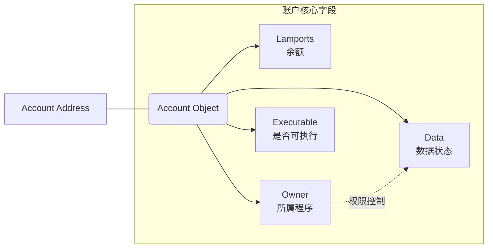
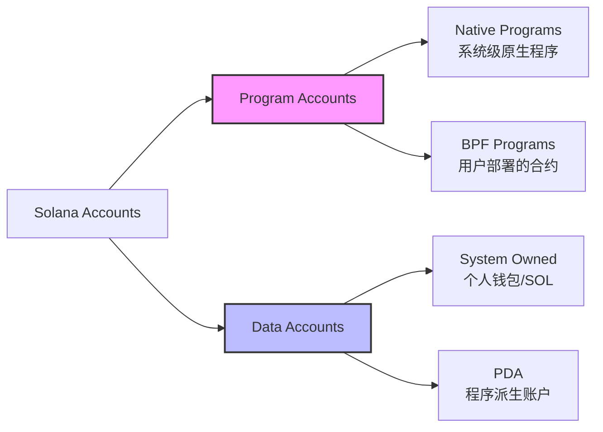

# Solana

**Solana（SOL）是一个专为高速、低成本交易而设计的高性能区块链平台。**

它通常被比作“区块链界的赛车”，因为它的处理速度远超比特币和以太坊，目标是为去中心化应用（DApps）、金融服务（DeFi）和 NFT 市场提供一个大规模扩展的基础设施。

## Solana 的核心特点

Solana 的崛起主要归功于它解决了一个被称为“区块链不可能三角”（即无法同时实现安全性、去中心化和高性能）的尝试。

- **极高的速度：** 理论上每秒可处理超过 **65,000 笔交易 (TPS)**，而以太坊（升级前）通常只有 15-30 TPS。

- **极低的手续费：** 每一笔交易的平均费用仅为 **$0.00025** 左右。你可以用 1 美元支付成千上万次转账。

- **原生代币 SOL：** 用于支付网络上的交易手续费，也可以通过“质押”来赚取奖励并参与网络治理。

### 为什么它能这么快？（核心技术）

[**There are 8 key innovations that make the Solana network possible**](https://solana.com/zh/news/sealevel---parallel-processing-thousands-of-smart-contracts)

>- [**Proof of History (POH)**](https://solana.ghost.io/solana-labs/proof-of-history-a-clock-for-blockchain-cf47a61a9274) — a clock before consensus;
>
>- [**Tower BFT**](https://medium.com/solana-labs/tower-bft-solanas-high-performance-implementation-of-pbft-464725911e79) — a PoH-optimized version of PBFT;
>- [**Turbine**](https://solana.ghost.io/solana-labs/turbine-solanas-block-propagation-protocol-solves-the-scalability-trilemma-2ddba46a51db) — a block propagation protocol;
>- [**Gulf Stream**](https://solana.ghost.io/solana-labs/gulf-stream-solanas-mempool-less-transaction-forwarding-protocol-d342e72186ad) — Mempool-less transaction forwarding protocol;
>- [**Sealevel**](https://medium.com/solana-labs/sealevel-parallel-processing-thousands-of-smart-contracts-d814b378192) — Parallel smart contracts run-time;
>- [**Pipelining**](https://solana.com/pipelining-in-solana-the-transaction-processing-unit/) — a Transaction Processing Unit for validation optimization
>- [**Cloudbreak**](https://medium.com/solana-labs/cloudbreak-solanas-horizontally-scaled-state-architecture-9a86679dcbb1) — Horizontally-Scaled Accounts Database; and
>- [**Archivers**](https://solana.com/archivers/) — Distributed ledger store

#### 1. 历史证明 (Proof of History, PoH) —— 共识前的“时钟”

这是 Solana 的基石。在传统区块链中，节点需要通过大量通信来确认交易发生的先后顺序（类似开会确认时间）。PoH 通过在账本中嵌入一个不可伪造的时间戳，让节点无需互相通信就能证明交易发生的先后顺序。

- **作用：** 极大地减少了节点间的通信开销，为网络提供了统一的时间参考。

#### 2. 塔式 BFT (Tower BFT) —— PoH 优化的算法

它是 Solana 版的实用拜占庭容错（PBFT）算法。由于有了 PoH 提供的统一时钟，节点在达成共识时不需要从头开始协商，而是利用 PoH 记录的时间轴来快速投票。

- **作用：** 大幅降低了达成共识的延迟（Latency）。

#### 3. 涡轮机 (Turbine) —— 区块传播协议

当一个大区块需要传输给数千个节点时，带宽压力极大。Turbine 将数据拆分成许多小数据包，采用类似于“激流（BitTorrent）”的树状结构进行传输。

- **作用：** 解决了大容量数据在网络中快速广播的瓶颈。

#### 4. 湾流 (Gulf Stream) —— 无内存池的转发协议

在以太坊中，交易会堆积在“内存池（Mempool）”中等待打包。而在 Solana 中，验证者可以提前知道未来的领导者（Leader），因此客户端可以直接将交易转发给即将上任的验证者。

- **作用：** 减少了确认时间，降低了验证者的内存压力，实现了极高的吞吐量。

#### 5. 海平面 (Sealevel) —— 并行智能合约运行时

传统公链通常是单线程执行（一次处理一个合约）。Sealevel 允许成千上万个不冲突的智能合约在多核 CPU 和 GPU 上**并行处理**。

- **作用：** 只要硬件性能足够（核心数多），处理速度就能线性提升。

#### 6. 流水线 (Pipelining) —— 验证优化处理单元

流水线是一种硬件优化技术。Solana 将交易验证的过程分为：获取数据、解密、验证签名、写入数据等步骤。不同的硬件模块可以同时处理不同交易的各个阶段（就像工厂流水线）。

- **作用：** 使得硬件效率利用到极致，进一步缩短了区块确认时间。

#### 7. 云断层 (Cloudbreak) —— 水平扩展的账户数据库

随着用户增多，读写账本数据的压力会剧增。Cloudbreak 是一种为大规模并行读写优化的数据结构，它不再依赖传统的单一数据库，而是利用内存映射文件（Memory-mapped files）和 SSD 协同工作。

- **作用：** 解决了在大规模并行环境下的数据读写瓶颈。

#### 8. 归档器 (Archivers) —— 分布式账本存储

Solana 每年产生的数据量非常巨大。为了防止普通节点因存储空间不足而退出，Solana 将数据分片并存储在名为 Archivers 的轻量级节点中。

- **作用：** 保证了账本数据的安全存储，同时降低了高性能验证者的存储负担。

------

#### 总结

Solana 的“快”是**全方位的硬件级优化**：

- **PoH 和 Tower BFT** 解决了“沟通慢”的问题；
- **Turbine 和 Gulf Stream** 解决了“传输慢”的问题；
- **Sealevel 和 Pipelining** 解决了“计算慢”的问题；
- **Cloudbreak 和 Archivers** 解决了“读写和存储慢”的问题。

这些创新共同作用，使 Solana 成为了目前公认的最接近硬件性能极限的区块链网络。

## 核心概念

### 账户 (Account)

> Everything is an Account

在 Solana 中，**“万物皆账户”**——无论是用户的钱包、智能合约（程序），还是合约存储的数据，都以账户的形式存在。就像 Linux 世界里把所有的资源都抽象成"文件"一样。

Solana 网络上的所有数据都存储在账户中。您可以将 Solana 网络视为一个包含单一账户表的公共数据库。账户与其地址之间的关系类似于键值对，其中键是地址，值是账户。

每个账户都有相同的基本**结构**，并且可以通过其**地址**找到。

#### 1. Solana 账户基本结构 (水平布局)

这张图展示了每一个 Solana 账户内部到底存了什么：

#### 2. 账户分类逻辑

这张图说明了 Solana 如何区分“程序”和“普通账户”

