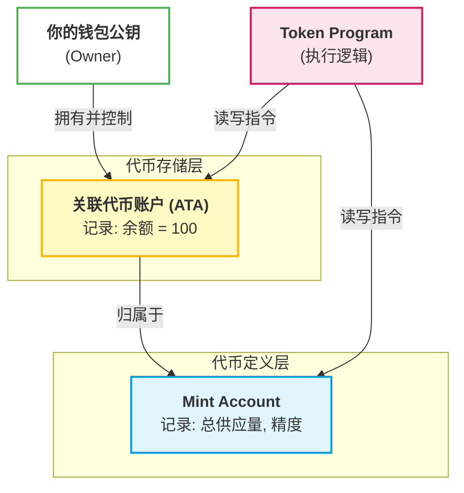

# 代币 Token

在区块链（尤其是 Solana）的语境下，**代币（Token）** 的本质是**由程序管理的一段账目记录**。

代币是代表多种资产类别所有权的数字资产。代币化使得产权的数字化成为可能。在 Solana 上，代币统称为 **SPL Token**（符合 Solana Program Library 标准的代币）。与以太坊不同，Solana 的代币并不是写在每个人的钱包地址里的，而是通过一套**账户组合**来管理的。

要理解代币，必须分清这四个核心概念：

- **Token Program（代币程序）**：这是链上的一段**公共代码**。所有的代币（无论是 USDC 还是某个山寨币）都共用这一段逻辑。它定义了“转账”、“铸造”和“销毁”该怎么做。
- **Mint Account（铸造账户）**：这是代币的“户口本”或“中央银行”。它记录了：这种代币叫什么？总共有多少个？小数位是多少？谁有权继续印钱？
- **Token Account（代币账户）**：这是属于你个人的“储蓄格”。它记录了：你持有了多少个特定的代币，以及这个代币属于哪个 Mint。
- **Associated Token Account（关联代币账户，简称 ATA）** 是 Solana 上一种特殊的 **PDA（程序派生地址）**，它是目前用户持有 SPL 代币（如 USDC、RAY、NFT 等）的**标准方式**。

## 代币的逻辑结构

代币并不像一个文件存放在你的电脑里，它更像是一个多层嵌套的引用关系：



## 代币的两大分类

### 同质化代币 (Fungible Tokens)

- **特点**：每一枚都完全一样，可以分割。
- **例子**：USDC、USDT、各种游戏币。
- **类比**：就像你口袋里的 100 元钞票，你的 100 元和我的 100 元购买力完全相同。

### 非同质化代币 (NFTs)

- **特点**：每一枚都是独一无二的，通常不可分割（供应量为 1，小数位为 0）。
- **例子**：数字艺术品、游戏里的独特装备、链上身份域名。
- **类比**：就像是一张编号唯一的演唱会门票，或者一张全球限量的球星卡。


## Token Program

Solana 生态系统有两个主要的 Token Program。

- **Token Program** (原始版本)
  - 基本代币功能（铸造、转移等）
  - 不可变且广泛使用

- **Token Extension Program** (Token 2022)
  - 包含所有原始 Token Program 功能
  - 通过 “扩展” 添加功能

Token Program 包含与网络上的代币（包括同质化和非同质化代币）交互的所有指令逻辑。Solana 上的所有代币实际上都是由 Token Program 拥有的 数据账户。


## Mint Account

Solana 上的代币通过由 Token Program 拥有的 Mint Account 的地址唯一标识。此账户充当特定代币的全局计数器，并存储以下数据：

- **供应量**：代币的总供应量
- **小数位数**：代币的小数精度
- **铸造权限**：被授权创建新代币单位的账户，增加供应量
- **冻结权限**：被授权冻结代币的账户，防止代币在 Token Account 中被转移或销毁


每个铸造账户中存储的完整详细信息包括以下内容：

```rust
pub struct Mint {
    /// Optional authority used to mint new tokens. The mint authority may only
    /// be provided during mint creation. If no mint authority is present
    /// then the mint has a fixed supply and no further tokens may be
    /// minted.
    pub mint_authority: COption<Pubkey>,
    /// Total supply of tokens.
    pub supply: u64,
    /// Number of base 10 digits to the right of the decimal place.
    pub decimals: u8,
    /// Is `true` if this structure has been initialized
    pub is_initialized: bool,
    /// Optional authority to freeze token accounts.
    pub freeze_authority: COption<Pubkey>,
}
```


## Token Account

Token Program 创建了 Token Accounts 来跟踪每个代币单位的个人所有权。Token Account 存储的数据包括：

- **铸造**：Token Account 持有的代币
- **所有者**：被授权从 Token Account 转移代币的账户
- **数量**：Token Account 当前持有的代币数量


每个 Token Account 中存储的完整详细信息包括以下内容：

```rust
pub struct Account {
    /// The mint associated with this account
    pub mint: Pubkey,
    /// The owner of this account.
    pub owner: Pubkey,
    /// The amount of tokens this account holds.
    pub amount: u64,
    /// If `delegate` is `Some` then `delegated_amount` represents
    /// the amount authorized by the delegate
    pub delegate: COption<Pubkey>,
    /// The account's state
    pub state: AccountState,
    /// If is_native.is_some, this is a native token, and the value logs the
    /// rent-exempt reserve. An Account is required to be rent-exempt, so
    /// the value is used by the Processor to ensure that wrapped SOL
    /// accounts do not drop below this threshold.
    pub is_native: COption<u64>,
    /// The amount delegated
    pub delegated_amount: u64,
    /// Optional authority to close the account.
    pub close_authority: COption<Pubkey>,
}
```

一个钱包需要为其想要持有的每种代币（铸造）创建一个 token account，并将钱包地址设置为 token account 的所有者。每个钱包可以为同一种代币（铸造）拥有多个 token account，但一个 token account 只能有一个所有者，并且只能持有一种代币（铸造）。


> [!NOTE]
>
> 请注意，每个 Token Account 的数据中包含一个 `owner` 字段，用于标识谁拥有该 Token Account 的权限。这与基础账户类型中指定的程序所有者不同，后者对于所有 Token Account 来说都是 Token Program。


## Associated Token Account

Associated Token Account (关联代币账户, ATA) 简化了为特定铸造和所有者查找 token account 地址的过程。可以将 Associated Token Account 视为特定铸造和所有者的“默认” token account。

关联代币账户是通过所有者地址和铸币账户地址派生出的地址创建的。需要注意的是，关联代币账户只是一个具有特定地址的代币账户。

这引入了 Solana 开发中的一个关键概念：程序派生地址 (PDA)。PDA 使用预定义的输入确定性地派生出一个地址，使得查找账户地址变得简单。


请注意，每个钱包需要自己的代币账户来持有来自同一铸币的代币。


